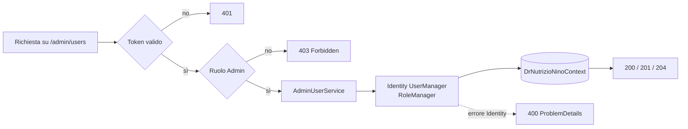

# Endpoint group: Admin

## 1. Introduzione

Il gruppo `Admin` espone la gestione degli utenti riservata agli amministratori: elenco, creazione, lettura, aggiornamento, eliminazione e cambio di ruolo.

- **Route base:** `api/v1/admin/users`
- **Tag Scalar:** `Admin`
- **File di mapping:** `Endpoints/AdminEndpoints.cs`
- **Versione API:** v1

## 2. Architettura

| Componente | Responsabilità |
|------------|----------------|
| `AdminEndpoints` | Mapping e risposte `ProblemDetails` |
| `AdminUserService` | Operazioni su utenti e ruoli tramite Identity |
| ASP.NET Core Identity | `UserManager<ApplicationUser>`, `RoleManager<IdentityRole<Guid>>` |
| `UserListItem`, `CreateUserRequest`, `UpdateUserRequest`, `ChangeRoleRequest` | DTO di richiesta e risposta |

I ruoli `User` e `Admin` sono seedati all'avvio da `DatabaseStartupService`.

## 3. Descrizione endpoint

| Metodo | URL | Descrizione | Parametri | Risposta |
|--------|-----|-------------|-----------|----------|
| GET | `/api/v1/admin/users` | Elenco di tutti gli utenti | — | `200` `IList<UserListItem>` |
| POST | `/api/v1/admin/users` | Registra un nuovo utente | body `CreateUserRequest` | `201` · `400` |
| GET | `/api/v1/admin/users/{id}` | Dettaglio utente | `id` (route, Guid) | `200` `UserListItem` · `404` |
| PUT | `/api/v1/admin/users/{id}` | Aggiorna username, email e data di nascita | `id` (route, Guid), body `UpdateUserRequest` | `204` · `400` |
| DELETE | `/api/v1/admin/users/{id}` | Elimina un utente | `id` (route, Guid) | `204` · `400` |
| PATCH | `/api/v1/admin/users/{id}/role` | Cambia il ruolo dell'utente (User ↔ Admin) | `id` (route, Guid), body `ChangeRoleRequest` | `204` · `400` |

**Autenticazione:** l'intero gruppo richiede la policy `AdminOnly`, applicata con `RequireAuthorization("AdminOnly")` a livello di `MapGroup`. Un utente autenticato senza ruolo `Admin` riceve `403 Forbidden`.

## 4. Flusso endpoint

> Il progetto non usa `IValidator<T>`: i controlli sull'input sono inline nell'handler e gli errori restituiti da Identity vengono tradotti in `400 ProblemDetails`.

## 5. Esempi

Nessun file `.http` dedicato a questo gruppo.

---
*Revisione v1.0 — 2026-07-29 22:24 — claude-opus-5*
