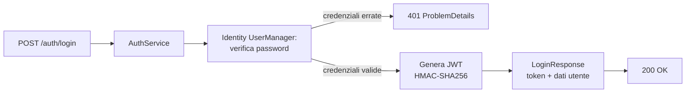
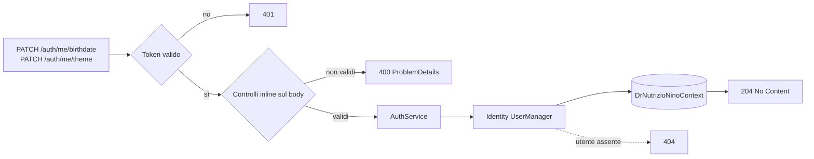

# Endpoint group: Auth

## 1. Introduzione

Il gruppo `Auth` gestisce l'accesso al sistema e i dati dell'utente autenticato: login con emissione del token JWT, logout, lettura del profilo corrente e aggiornamento di data di nascita e preferenza tema.

- **Route base:** `api/v1/auth`
- **Tag Scalar:** `Auth`
- **File di mapping:** `Endpoints/AuthEndpoints.cs`
- **Versione API:** v1

## 2. Architettura

| Componente | Responsabilità |
|------------|----------------|
| `AuthEndpoints` | Mapping e risposte `ProblemDetails` |
| `AuthService` | Verifica credenziali, emissione JWT, lettura e aggiornamento dati utente |
| ASP.NET Core Identity | Store utenti e ruoli, hashing password (`ApplicationUser`, `IdentityRole<Guid>`) |
| `DrNutrizioNinoContext` | Store Identity via `AddEntityFrameworkStores` |
| `LoginRequest`, `LoginResponse`, `MeResponse`, `UpdateBirthdateRequest`, `UpdateThemeRequest` | DTO di richiesta e risposta |

**Configurazione del token** (da `Program.cs`):

| Parametro | Valore |
|-----------|--------|
| Schema | JWT Bearer (sovrascrive gli schema default di Identity) |
| Firma | HMAC-SHA256 con chiave da `Jwt:Secret` |
| Validazione issuer | disattivata |
| Validazione audience | disattivata |
| ClockSkew | 5 minuti |

**Regole password Identity:** lunghezza minima 8, nessun requisito di caratteri non alfanumerici o maiuscole, email univoca obbligatoria.

## 3. Descrizione endpoint

| Metodo | URL | Descrizione | Parametri | Risposta |
|--------|-----|-------------|-----------|----------|
| POST | `/api/v1/auth/login` | Verifica le credenziali ed emette il token | body `LoginRequest` | `200` `LoginResponse` · `401` |
| POST | `/api/v1/auth/logout` | Chiude la sessione lato server | — | `204` |
| GET | `/api/v1/auth/me` | Dati dell'utente autenticato | — | `200` `MeResponse` · `404` |
| PATCH | `/api/v1/auth/me/birthdate` | Aggiorna la data di nascita dell'utente autenticato | body `UpdateBirthdateRequest` | `204` · `404` |
| PATCH | `/api/v1/auth/me/theme` | Aggiorna la preferenza di tema UI | body `UpdateThemeRequest` | `204` · `400` · `404` |

**Autenticazione:** `login` e `logout` sono anonimi. `GET me`, `PATCH me/birthdate` e `PATCH me/theme` richiedono un token valido.

## 4. Flusso endpoint

Login:

Aggiornamento dati dell'utente autenticato:

> Il progetto non usa `IValidator<T>`: i controlli sull'input sono inline nell'handler.

## 5. Esempi

Nessun file `.http` dedicato a questo gruppo.

---
*Revisione v1.0 — 2026-07-29 22:24 — claude-opus-5*
