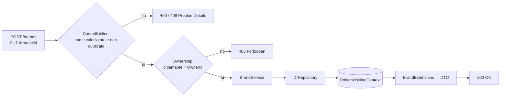
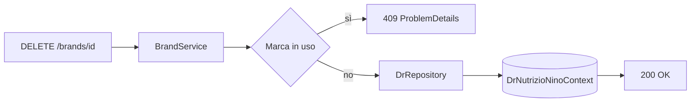

# Endpoint group: Brands

## 1. Introduzione

Il gruppo `Brands` gestisce le marche associabili agli alimenti. Espone il CRUD completo più una verifica di utilizzo, usata dalla UI per disabilitare l'eliminazione di marche già referenziate.

- **Route base:** `api/v1/brands`
- **Tag Scalar:** `Brands`
- **File di mapping:** `Endpoints/BrandsEndpoints.cs`
- **Versione API:** v1

## 2. Architettura

| Componente | Responsabilità |
|------------|----------------|
| `BrandsEndpoints` | Mapping, controlli di ownership, risposte `ProblemDetails` |
| `BrandService` | Logica applicativa CRUD e clonazione |
| `DrRepository` (`DrRepository.Brands.cs`) | Accesso dati EF Core |
| `Brand`, `Brand.Ownership` | Entità EF Core con proprietario opzionale |
| `BrandExtensions` | Proiezione entità → DTO |
| `BrandDto`, `BrandListItem`, `CreateBrandDto` | DTO di richiesta e risposta |

Come per gli alimenti, le marche hanno un `OwnerId` opzionale: aggiornamento ed eliminazione restituiscono `403 Forbidden` a chi non è il proprietario.

## 3. Descrizione endpoint

| Metodo | URL | Descrizione | Parametri | Risposta |
|--------|-----|-------------|-----------|----------|
| GET | `/api/v1/brands` | Elenco di tutte le marche | — | `200` `IList<BrandListItem>` · `404` |
| GET | `/api/v1/brands/{id}` | Dettaglio marca | `id` (route, Guid) | `200` `BrandDto` · `404` |
| POST | `/api/v1/brands` | Crea una marca | body `CreateBrandDto` | `200` `BrandListItem` · `400` · `409` nome duplicato |
| PUT | `/api/v1/brands/{id}` | Aggiorna una marca | `id` (route, Guid), body `Brand` | `200` · `400` · `403` · `404` |
| GET | `/api/v1/brands/{id}/is-in-use` | Indica se la marca è referenziata da almeno un alimento | `id` (route, Guid) | `200` `bool` |
| DELETE | `/api/v1/brands/{id}` | Elimina una marca | `id` (route, Guid) | `200` · `403` · `404` · `409` marca in uso |
| POST | `/api/v1/brands/{id}/clone` | Copia una marca esistente | `id` (route, Guid) | `201` `BrandDto` · `404` |

**Autenticazione:** richiesta su `POST`, `PUT`, `DELETE` e `POST {id}/clone`. Le letture e `is-in-use` sono anonime.

## 4. Flusso endpoint

Creazione e aggiornamento:

Eliminazione:

> Il progetto non usa `IValidator<T>`: i controlli sull'input sono inline nell'handler.

## 5. Esempi

Per i casi d'uso fare riferimento a `src/Dr.NutrizioNino.Api/Dr.NutrizioNino.Api.http`.

---
*Revisione v1.0 — 2026-07-29 22:24 — claude-opus-5*
