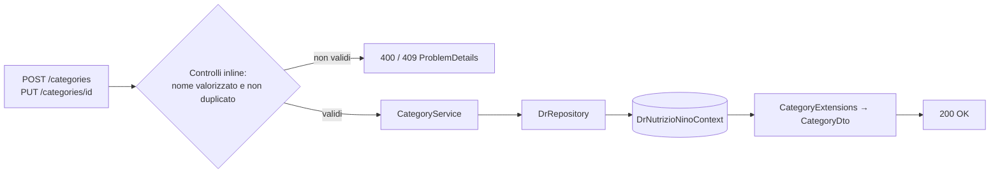
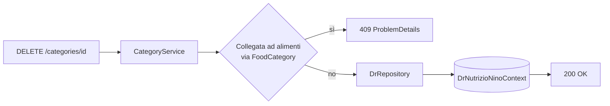

# Endpoint group: Categories

## 1. Introduzione

Il gruppo `Categories` gestisce le categorie merceologiche associabili agli alimenti tramite una relazione molti-a-molti. Espone il CRUD completo più una verifica di utilizzo.

- **Route base:** `api/v1/categories`
- **Tag Scalar:** `Categories`
- **File di mapping:** `Endpoints/CategoriesEndpoints.cs`
- **Versione API:** v1

## 2. Architettura

| Componente | Responsabilità |
|------------|----------------|
| `CategoriesEndpoints` | Mapping e risposte `ProblemDetails` |
| `CategoryService` | Logica applicativa CRUD e verifica utilizzo |
| `DrRepository` (`DrRepository.Categories.cs`) | Accesso dati EF Core |
| `Category`, `FoodCategory` | Entità EF Core, la seconda è la tabella di associazione con `Food` |
| `CategoryExtensions` | Proiezione entità → DTO |
| `CategoryDto`, `CreateCategoryDto` | DTO di richiesta e risposta |

## 3. Descrizione endpoint

| Metodo | URL | Descrizione | Parametri | Risposta |
|--------|-----|-------------|-----------|----------|
| GET | `/api/v1/categories` | Elenco di tutte le categorie | — | `200` `IList<CategoryDto>` · `404` |
| GET | `/api/v1/categories/{id}` | Dettaglio categoria | `id` (route, Guid) | `200` `CategoryDto` · `404` |
| POST | `/api/v1/categories` | Crea una categoria | body `CreateCategoryDto` | `200` `CategoryDto` · `400` · `409` nome duplicato |
| PUT | `/api/v1/categories/{id}` | Aggiorna una categoria | `id` (route, Guid), body `Category` | `200` · `400` · `404` · `409` |
| GET | `/api/v1/categories/{id}/is-in-use` | Indica se la categoria è collegata ad almeno un alimento | `id` (route, Guid) | `200` `bool` |
| DELETE | `/api/v1/categories/{id}` | Elimina una categoria | `id` (route, Guid) | `200` · `404` · `409` categoria in uso |

**Autenticazione:** nessun endpoint del gruppo richiede autenticazione.

## 4. Flusso endpoint

> Il progetto non usa `IValidator<T>`: i controlli sull'input sono inline nell'handler.

## 5. Esempi

Nessun file `.http` dedicato a questo gruppo.

---
*Revisione v1.0 — 2026-07-29 22:24 — claude-opus-5*
