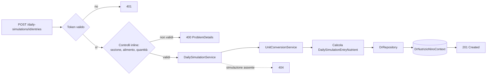
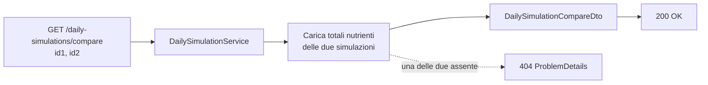

# Endpoint group: DailySimulations

## 1. Introduzione

Il gruppo `DailySimulations` gestisce le simulazioni di giornata alimentare: insiemi di alimenti e ricette distribuiti nelle sezioni del giorno (colazione, pranzo, cena e così via) di cui il sistema calcola l'apporto nutrizionale complessivo. Oltre al CRUD, espone la gestione delle singole voci e il confronto tra due simulazioni.

- **Route base:** `api/v1/daily-simulations`
- **Tag Scalar:** `DailySimulations`
- **File di mapping:** `Endpoints/DailySimulationEndpoints.cs`
- **Versione API:** v1

## 2. Architettura

| Componente | Responsabilità |
|------------|----------------|
| `DailySimulationEndpoints` | Mapping e risposte `ProblemDetails` |
| `DailySimulationService` | Logica applicativa: CRUD, voci, ricalcolo nutrienti, confronto |
| `UnitConversionService` | Conversione delle quantità durante il calcolo |
| `DrRepository` (`DrRepository.DailySimulation.cs`) | Accesso dati EF Core |
| `DailySimulation`, `DailySimulationEntry`, `DailySimulationEntryNutrient` | Entità EF Core |
| `DailySimulationListItemDto`, `DailySimulationDetailDto`, `DailySimulationCompareDto` | DTO di risposta |
| `CreateDailySimulationDto`, `RenameDailySimulationDto`, `AddSimulationEntryDto`, `UpdateEntryQuantityDto` | DTO di richiesta |

Le sezioni in cui si organizzano le voci sono gestite dal gruppo `Sections`. Le soglie di confronto mostrate nei grafici provengono dal gruppo `NutritionalTarget`.

## 3. Descrizione endpoint

| Metodo | URL | Descrizione | Parametri | Risposta |
|--------|-----|-------------|-----------|----------|
| GET | `/api/v1/daily-simulations` | Elenco delle simulazioni dell'utente | — | `200` `IList<DailySimulationListItemDto>` |
| POST | `/api/v1/daily-simulations` | Crea una simulazione | body `CreateDailySimulationDto` | `201` · `400` |
| GET | `/api/v1/daily-simulations/{id}` | Dettaglio con sezioni, voci e totali nutrizionali | `id` (route, Guid) | `200` `DailySimulationDetailDto` · `404` |
| PUT | `/api/v1/daily-simulations/{id}` | Rinomina una simulazione | `id` (route, Guid), body `RenameDailySimulationDto` | `200` · `404` |
| DELETE | `/api/v1/daily-simulations/{id}` | Elimina una simulazione | `id` (route, Guid) | `200` · `404` |
| POST | `/api/v1/daily-simulations/{id}/clone` | Copia una simulazione esistente | `id` (route, Guid) | `201` · `404` |
| POST | `/api/v1/daily-simulations/{id}/entries` | Aggiunge una voce a una sezione | `id` (route, Guid), body `AddSimulationEntryDto` | `201` · `400` · `404` |
| PUT | `/api/v1/daily-simulations/{id}/entries/{entryId}` | Aggiorna la quantità di una voce | `id`, `entryId` (route, Guid), body `UpdateEntryQuantityDto` | `200` · `400` · `404` · `422` |
| DELETE | `/api/v1/daily-simulations/{id}/entries/{entryId}` | Rimuove una voce | `id`, `entryId` (route, Guid) | `200` · `404` |
| GET | `/api/v1/daily-simulations/compare` | Confronta i nutrienti di due simulazioni | `id1`, `id2` (query, Guid) | `200` `DailySimulationCompareDto` · `404` |

**Autenticazione:** richiesta su tutto il gruppo (`RequireAuthorization()` sul `MapGroup`). Ogni simulazione appartiene all'utente ricavato dal token.

## 4. Flusso endpoint

Aggiunta di una voce:

Confronto tra due simulazioni:

> Il progetto non usa `IValidator<T>`: i controlli sull'input sono inline nell'handler. L'aggiornamento della quantità restituisce `422` quando la conversione tra unità di misura non è possibile.

## 5. Esempi

Nessun file `.http` dedicato a questo gruppo.

---
*Revisione v1.0 — 2026-07-29 22:24 — claude-opus-5*
