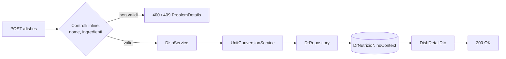
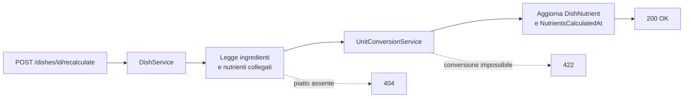

# Endpoint group: Dishes

## 1. Introduzione

Il gruppo `Dishes` gestisce i piatti, cioè alimenti composti da più ingredienti. Oltre al CRUD, espone il ricalcolo dei valori nutrizionali e il riscalamento del peso complessivo.

- **Route base:** `api/v1/dishes`
- **Tag Scalar:** `Dishes`
- **File di mapping:** `Endpoints/DishEndpoints.cs`
- **Versione API:** v1

## 2. Architettura

| Componente | Responsabilità |
|------------|----------------|
| `DishEndpoints` | Mapping, controlli di ownership, risposte `ProblemDetails` |
| `DishService` | Logica applicativa: dashboard, dettaglio, creazione, clonazione, ricalcolo, riscalamento |
| `UnitConversionService` | Conversione tra unità di misura durante il calcolo nutrizionale |
| `DrRepository` (`DrRepository.Dish.cs`) | Accesso dati EF Core |
| `Dish`, `DishIngredient`, `DishNutrient`, `DishDashboardInfo` | Entità EF Core |
| `DishDetailDto`, `DishIngredientDto` | DTO di risposta |

I valori nutrizionali di un piatto sono calcolati a partire dagli ingredienti e memorizzati. Quando un ingrediente cambia, il piatto diventa *stale*: l'endpoint `recalculate-stale` ricalcola in blocco tutti i piatti in questo stato.

## 3. Descrizione endpoint

| Metodo | URL | Descrizione | Parametri | Risposta |
|--------|-----|-------------|-----------|----------|
| GET | `/api/v1/dishes/dashboard` | Elenco dashboard dei piatti | — | `200` `IList<DishDashboardInfo>` |
| GET | `/api/v1/dishes/{id}` | Dettaglio del piatto con ingredienti e nutrienti | `id` (route, Guid) | `200` `DishDetailDto` · `404` |
| POST | `/api/v1/dishes` | Crea un piatto | body `CreateDishDto` | `200` `DishDetailDto` · `400` · `409` |
| DELETE | `/api/v1/dishes/{id}` | Elimina un piatto | `id` (route, Guid) | `200` · `403` |
| POST | `/api/v1/dishes/{id}/clone` | Copia un piatto esistente | `id` (route, Guid) | `201` `DishDetailDto` · `404` |
| POST | `/api/v1/dishes/{id}/recalculate` | Ricalcola i nutrienti di un piatto | `id` (route, Guid) | `200` · `404` · `422` |
| POST | `/api/v1/dishes/recalculate-stale` | Ricalcola tutti i piatti con nutrienti obsoleti | — | `200` riepilogo operazione |
| PATCH | `/api/v1/dishes/{id}/quantity` | Riscala il peso del piatto e i valori derivati | `id` (route, Guid), body `RescaleDishRequest` | `200` · `400` · `404` · `422` |

**Autenticazione:** richiesta su `POST /dishes`, `DELETE {id}` e `POST {id}/clone`. Le letture e i ricalcoli sono anonimi.

## 4. Flusso endpoint

Creazione:

Ricalcolo nutrienti:

> Il progetto non usa `IValidator<T>`: i controlli sull'input sono inline nell'handler.

## 5. Esempi

Nessun file `.http` dedicato a questo gruppo.

---
*Revisione v1.0 — 2026-07-29 22:24 — claude-opus-5*
