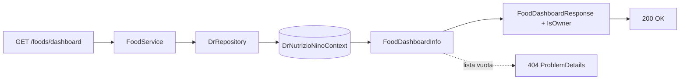
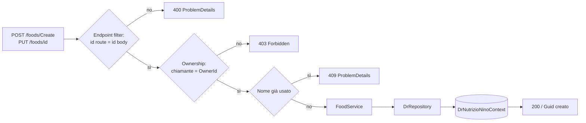
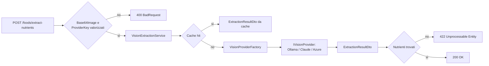

# Endpoint group: Foods

## 1. Introduzione

Il gruppo `Foods` gestisce gli alimenti, l'unità base del diario alimentare. Copre lettura di dettaglio e dashboard, ricerca di nomi simili per evitare duplicati, creazione, aggiornamento, eliminazione, clonazione ed estrazione dei nutrienti da una foto di etichetta tramite provider LLM.

- **Route base:** `api/v1/foods`
- **Tag Scalar:** `Foods`
- **File di mapping:** `Endpoints/FoodEndpoints.cs`, `Endpoints/FoodVisionMapping.cs`
- **Versione API:** v1

Il gruppo è mappato da due file distinti. `FoodEndpoints.cs` espone il CRUD e non richiede autenticazione sulle letture; `FoodVisionMapping.cs` monta un secondo `MapGroup` sulla stessa route base con `RequireAuthorization()` applicato all'intero gruppo.

## 2. Architettura

| Componente | Responsabilità |
|------------|----------------|
| `FoodEndpoints` | Mapping CRUD, controlli di ownership, risposte `ProblemDetails` |
| `FoodVisionMapping` | Mapping dell'estrazione nutrienti da immagine |
| `FoodService` | Logica applicativa: dashboard, dettaglio completo, nomi simili, insert/update/delete |
| `VisionExtractionService` | Orchestrazione dell'estrazione: cache, scelta provider, normalizzazione risultato |
| `VisionProviderFactory` | Seleziona l'implementazione `IVisionProvider` in base a `ProviderKey` |
| `DrRepository` (`DrRepository.Food.cs`) | Accesso dati EF Core |
| `DrNutrizioNinoContext` | `DbContext`, registrato via `AddDbContextFactory` |
| `FoodInfo`, `FoodDashboardInfo`, `FoodSuggestionDto`, `ExtractionResultDto` | Modelli di risposta |
| `ClaimsPrincipalExtensions.GetUserId()` | Estrae l'id utente dal token per i controlli di ownership |

Gli alimenti hanno un proprietario opzionale (`OwnerId`). Modifica ed eliminazione restituiscono `403 Forbidden` se il chiamante non è il proprietario. Gli alimenti senza proprietario restano modificabili da chiunque sia autenticato.

## 3. Descrizione endpoint

| Metodo | URL | Descrizione | Parametri | Risposta |
|--------|-----|-------------|-----------|----------|
| GET | `/api/v1/foods/{id}` | Dettaglio completo dell'alimento | `id` (route, Guid) | `200` `FoodInfo` · `404` |
| GET | `/api/v1/foods/dashboard` | Elenco dashboard degli alimenti | `name` (query, opzionale, match parziale case-insensitive) | `200` lista dashboard · `404` |
| GET | `/api/v1/foods/dashboard/{id}` | Singola riga dashboard | `id` (route, Guid) | `200` riga dashboard · `404` |
| GET | `/api/v1/foods/similar` | Fino a 8 alimenti con nome simile, per evitare duplicati durante la digitazione | `query` (query, opzionale) | `200` `IList<FoodSuggestionDto>` · `429` |
| GET | `/api/v1/foods/newgui` | Genera un nuovo Guid come stringa per l'inizializzazione della GUI | — | `200` `string` |
| GET | `/api/v1/foods/getnewfood` | Template di alimento vuoto | — | `200` `FoodInfo` |
| POST | `/api/v1/foods/Create` | Crea un alimento con i nutrienti collegati | body `FoodInfo` | `200` `Guid` · `400` · `409` nome duplicato |
| PUT | `/api/v1/foods/{id}` | Aggiorna alimento e nutrienti | `id` (route, Guid), body `FoodInfo` | `200` · `400` · `403` · `404` · `409` |
| DELETE | `/api/v1/foods/{id}` | Elimina alimento e nutrienti collegati | `id` (route, Guid) | `200` · `403` |
| POST | `/api/v1/foods/{id}/clone` | Copia l'alimento assegnandolo all'utente corrente, con suffisso "(copia)" | `id` (route, Guid) | `201` `FoodInfo` · `404` |
| POST | `/api/v1/foods/extract-nutrients` | Estrae i nutrienti da un'immagine di etichetta | body `{ Base64Image, ProviderKey, MediaType }` | `200` `ExtractionResultDto` · `400` · `422` etichetta non riconosciuta · `429` |

**Autenticazione:** richiesta su `POST Create`, `PUT {id}`, `DELETE {id}`, `POST {id}/clone` e su tutto il gruppo vision (`POST extract-nutrients`). Le letture sono anonime, ma `GET dashboard` usa il token, se presente, per calcolare il flag `IsOwner`.

**Rate limiting:** `GET similar` usa la policy `food-search` (30 req/min). `POST extract-nutrients` usa la policy `vision` (3 req/min).

## 4. Flusso endpoint

Lettura dashboard:

Creazione e aggiornamento:

> Il progetto non usa `IValidator<T>`: la validazione avviene inline nell'handler e, per `PUT {id}`, tramite un `AddEndpointFilter` che verifica la coerenza tra id di route e id nel body.

Estrazione nutrienti da immagine:

## 5. Esempi

Per i casi d'uso fare riferimento a `src/Dr.NutrizioNino.Api/Dr.NutrizioNino.Api.http` e `src/Dr.NutrizioNino.Api/FoodVision.http`.

---
*Revisione v1.0 — 2026-07-29 22:24 — claude-opus-5*
