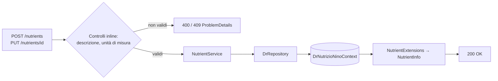
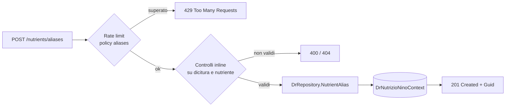

# Endpoint group: Nutrients

## 1. Introduzione

Il gruppo `Nutrients` gestisce l'anagrafica dei nutrienti (proteine, carboidrati, grassi, micronutrienti) e il loro ordinamento di visualizzazione. Include inoltre il salvataggio degli alias generati dall'estrazione AI, che permettono di riconoscere in futuro le diciture non standard trovate sulle etichette.

- **Route base:** `api/v1/nutrients`
- **Tag Scalar:** `Nutrients`
- **File di mapping:** `Endpoints/NutrientsEndpoints.cs`, `Endpoints/NutrientAliasMapping.cs`
- **Versione API:** v1

Il gruppo è mappato da due file. `NutrientsEndpoints.cs` espone il CRUD; `NutrientAliasMapping.cs` monta un secondo `MapGroup` sulla stessa route base con `RequireAuthorization()` applicato all'intero gruppo.

## 2. Architettura

| Componente | Responsabilità |
|------------|----------------|
| `NutrientsEndpoints` | Mapping CRUD e riordino |
| `NutrientAliasMapping` | Mapping del salvataggio alias |
| `NutrientService` | Logica applicativa |
| `DrRepository` (`DrRepository.Nutrients.cs`, `DrRepository.NutrientAlias.cs`) | Accesso dati EF Core |
| `Nutrient`, `Nutrient.UnitOfMeasure`, `NutrientAlias` | Entità EF Core |
| `NutrientExtensions` | Proiezione entità → DTO |
| `NutrientInfo`, `CreateNutrientDto`, `NutrientReorderItem` | DTO di richiesta e risposta |

## 3. Descrizione endpoint

| Metodo | URL | Descrizione | Parametri | Risposta |
|--------|-----|-------------|-----------|----------|
| GET | `/api/v1/nutrients` | Elenco di tutti i nutrienti | — | `200` `IList<NutrientInfo>` · `404` |
| GET | `/api/v1/nutrients/{id}` | Dettaglio nutriente | `id` (route, Guid) | `200` `NutrientInfo` · `404` |
| POST | `/api/v1/nutrients` | Crea un nutriente | body `CreateNutrientDto` | `200` `NutrientInfo` · `400` · `409` |
| PUT | `/api/v1/nutrients/{id}` | Aggiorna un nutriente | `id` (route, Guid), body `Nutrient` | `200` · `400` · `404` · `409` |
| PUT | `/api/v1/nutrients/reorder` | Riordina i nutrienti | body `IList<NutrientReorderItem>` | `200` · `400` |
| DELETE | `/api/v1/nutrients/{id}` | Elimina un nutriente | `id` (route, Guid) | `200` · `404` · `409` nutriente in uso |
| POST | `/api/v1/nutrients/aliases` | Salva un alias di nutriente riconosciuto dall'AI | body con dicitura originale e nutriente di destinazione | `201` `Guid` · `400` · `404` · `429` |

**Autenticazione:** `PUT /reorder` richiede la policy `AdminOnly`. `POST /aliases` richiede autenticazione (applicata a livello di gruppo). Gli altri endpoint sono anonimi.

**Rate limiting:** `POST /aliases` usa la policy `aliases` (10 req/min).

## 4. Flusso endpoint

CRUD:

Salvataggio alias:

> Il progetto non usa `IValidator<T>`: i controlli sull'input sono inline nell'handler.

## 5. Esempi

Per i casi d'uso fare riferimento a `src/Dr.NutrizioNino.Api/Dr.NutrizioNino.Api.http`.

---
*Revisione v1.0 — 2026-07-29 22:24 — claude-opus-5*
