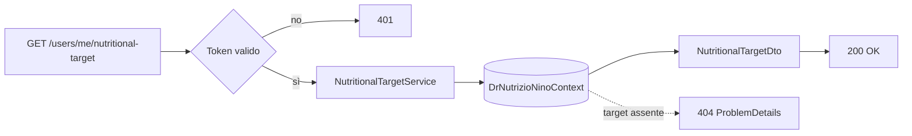
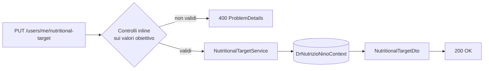

# Endpoint group: NutritionalTarget

## 1. Introduzione

Il gruppo `NutritionalTarget` gestisce il fabbisogno nutrizionale personale dell'utente: i valori obiettivo usati come soglie di confronto nelle simulazioni giornaliere.

- **Route base:** `api/v1/users/me/nutritional-target`
- **Tag Scalar:** `NutritionalTarget`
- **File di mapping:** `Endpoints/NutritionalTargetEndpoints.cs`
- **Versione API:** v1

## 2. Architettura

| Componente | Responsabilità |
|------------|----------------|
| `NutritionalTargetEndpoints` | Mapping e risposte `ProblemDetails` |
| `NutritionalTargetService` | Lettura e impostazione del fabbisogno |
| `NutritionalTarget` | Entità EF Core |
| `NutritionalTargetDto`, `SetNutritionalTargetDto` | DTO di risposta e richiesta |
| `ClaimsPrincipalExtensions.GetUserId()` | Estrae l'id utente dal token |

I valori del fabbisogno alimentano le soglie mostrate nei grafici delle simulazioni giornaliere (gruppo `DailySimulations`).

## 3. Descrizione endpoint

| Metodo | URL | Descrizione | Parametri | Risposta |
|--------|-----|-------------|-----------|----------|
| GET | `/api/v1/users/me/nutritional-target` | Fabbisogno nutrizionale corrente dell'utente | — | `200` `NutritionalTargetDto` · `404` non ancora impostato |
| PUT | `/api/v1/users/me/nutritional-target` | Imposta o aggiorna il fabbisogno | body `SetNutritionalTargetDto` | `200` `NutritionalTargetDto` · `400` |

**Autenticazione:** richiesta su tutto il gruppo (`RequireAuthorization()` sul `MapGroup`).

## 4. Flusso endpoint

> Il progetto non usa `IValidator<T>`: i controlli sull'input sono inline nell'handler.

## 5. Esempi

Nessun file `.http` dedicato a questo gruppo.

---
*Revisione v1.0 — 2026-07-29 22:24 — claude-opus-5*
