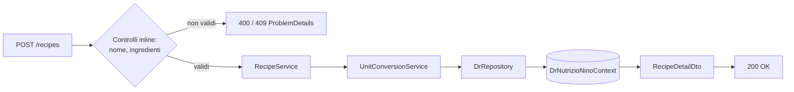
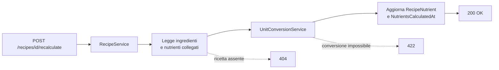

# Endpoint group: Recipes

## 1. Introduzione

Il gruppo `Recipes` gestisce le ricette, cioè alimenti composti da più ingredienti. Oltre al CRUD, espone il ricalcolo dei valori nutrizionali e il riscalamento del peso complessivo.

- **Route base:** `api/v1/recipes`
- **Tag Scalar:** `Recipes`
- **File di mapping:** `Endpoints/RecipeEndpoints.cs`
- **Versione API:** v1

## 2. Architettura

| Componente | Responsabilità |
|------------|----------------|
| `RecipeEndpoints` | Mapping, controlli di ownership, risposte `ProblemDetails` |
| `RecipeService` | Logica applicativa: dashboard, dettaglio, creazione, clonazione, ricalcolo, riscalamento |
| `UnitConversionService` | Conversione tra unità di misura durante il calcolo nutrizionale |
| `DrRepository` (`DrRepository.Recipe.cs`) | Accesso dati EF Core |
| `Recipe`, `RecipeIngredient`, `RecipeNutrient`, `RecipeDashboardInfo` | Entità EF Core |
| `RecipeDetailDto`, `RecipeIngredientDto` | DTO di risposta |

I valori nutrizionali di una ricetta sono calcolati a partire dagli ingredienti e memorizzati. Quando un ingrediente cambia, la ricetta diventa *stale*: l'endpoint `recalculate-stale` ricalcola in blocco tutte le ricette in questo stato.

## 3. Descrizione endpoint

| Metodo | URL | Descrizione | Parametri | Risposta |
|--------|-----|-------------|-----------|----------|
| GET | `/api/v1/recipes/dashboard` | Elenco dashboard delle ricette | — | `200` `IList<RecipeDashboardInfo>` |
| GET | `/api/v1/recipes/{id}` | Dettaglio della ricetta con ingredienti e nutrienti | `id` (route, Guid) | `200` `RecipeDetailDto` · `404` |
| POST | `/api/v1/recipes` | Crea una ricetta | body `CreateRecipeDto` | `200` `RecipeDetailDto` · `400` · `409` |
| DELETE | `/api/v1/recipes/{id}` | Elimina una ricetta | `id` (route, Guid) | `200` · `403` |
| POST | `/api/v1/recipes/{id}/clone` | Copia una ricetta esistente | `id` (route, Guid) | `201` `RecipeDetailDto` · `404` |
| POST | `/api/v1/recipes/{id}/recalculate` | Ricalcola i nutrienti di una ricetta | `id` (route, Guid) | `200` · `404` · `422` |
| POST | `/api/v1/recipes/recalculate-stale` | Ricalcola tutte le ricette con nutrienti obsoleti | — | `200` riepilogo operazione |
| PATCH | `/api/v1/recipes/{id}/quantity` | Riscala il peso della ricetta e i valori derivati | `id` (route, Guid), body `RescaleRecipeRequest` | `200` · `400` · `404` · `422` |

**Autenticazione:** richiesta su `POST /recipes`, `DELETE {id}` e `POST {id}/clone`. Le letture e i ricalcoli sono anonimi.

## 4. Flusso endpoint

Creazione:

Ricalcolo nutrienti:

> Il progetto non usa `IValidator<T>`: i controlli sull'input sono inline nell'handler.

## 5. Esempi

Nessun file `.http` dedicato a questo gruppo.

---
*Revisione v1.1 — 2026-08-15 — claude-opus-5 — rename dominio Dish → Recipe*
