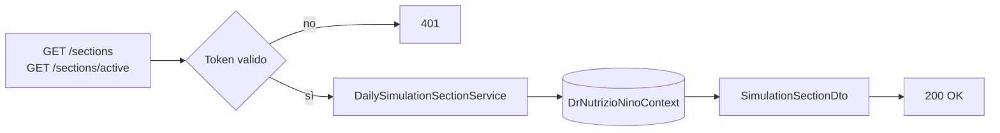
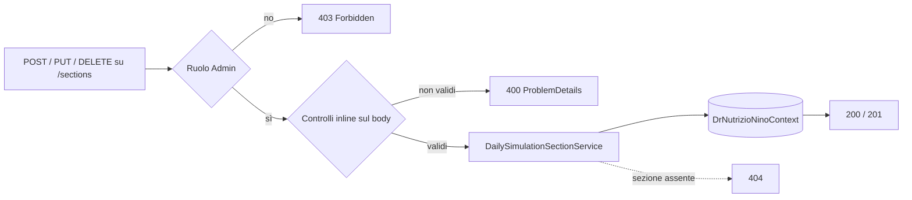

# Endpoint group: Sections

## 1. Introduzione

Il gruppo `Sections` gestisce le sezioni in cui si articola una giornata alimentare (colazione, spuntino, pranzo, cena e simili). Le sezioni sono un'anagrafica condivisa: la lettura è aperta a tutti gli utenti autenticati, la modifica è riservata agli amministratori.

- **Route base:** `api/v1/sections`
- **Tag Scalar:** `Sections`
- **File di mapping:** `Endpoints/DailySimulationSectionEndpoints.cs`
- **Versione API:** v1

## 2. Architettura

| Componente | Responsabilità |
|------------|----------------|
| `DailySimulationSectionEndpoints` | Mapping e risposte `ProblemDetails` |
| `DailySimulationSectionService` | Logica applicativa: elenco, creazione, riordino, rinomina, soft-delete |
| `DailySimulationSection` | Entità EF Core |
| `SimulationSectionDto`, `CreateSimulationSectionDto`, `UpdateSimulationSectionDto`, `SimulationSectionReorderItem` | DTO di richiesta e risposta |

L'eliminazione è logica (soft-delete): la sezione esce dall'elenco delle attive ma resta referenziabile dalle simulazioni già create.

## 3. Descrizione endpoint

| Metodo | URL | Descrizione | Parametri | Risposta |
|--------|-----|-------------|-----------|----------|
| GET | `/api/v1/sections` | Elenco di tutte le sezioni | — | `200` `IList<SimulationSectionDto>` |
| GET | `/api/v1/sections/active` | Elenco delle sole sezioni attive | — | `200` `IList<SimulationSectionDto>` |
| POST | `/api/v1/sections` | Crea una sezione | body `CreateSimulationSectionDto` | `201` · `400` |
| PUT | `/api/v1/sections/reorder` | Riordina le sezioni | body `IList<SimulationSectionReorderItem>` | `200` |
| PUT | `/api/v1/sections/{id}` | Rinomina una sezione | `id` (route, Guid), body `UpdateSimulationSectionDto` | `200` · `400` · `404` |
| DELETE | `/api/v1/sections/{id}` | Soft-delete di una sezione | `id` (route, Guid) | `200` · `404` |

**Autenticazione:** l'intero gruppo richiede un token valido (`RequireAuthorization()` sul `MapGroup`). `POST`, `PUT /reorder`, `PUT {id}` e `DELETE {id}` richiedono in più la policy `AdminOnly`.

## 4. Flusso endpoint

> Il progetto non usa `IValidator<T>`: i controlli sull'input sono inline nell'handler.

## 5. Esempi

Nessun file `.http` dedicato a questo gruppo.

---
*Revisione v1.0 — 2026-07-29 22:24 — claude-opus-5*
