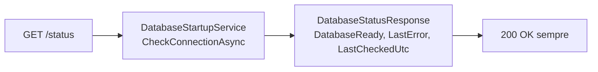
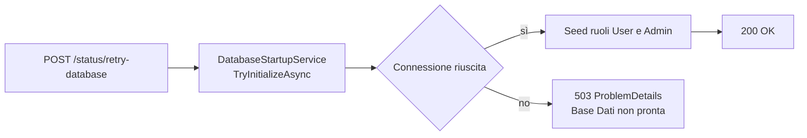

# Endpoint group: Status

## 1. Introduzione

Il gruppo `Status` espone lo stato di raggiungibilità del database e permette di ritentare la connessione senza riavviare il processo. Serve la strategia di avvio resiliente: se il database non risponde all'avvio, l'API parte comunque in stato degradato invece di terminare.

- **Route base:** `api/v1/status`
- **Tag Scalar:** `Status`
- **File di mapping:** `Endpoints/HealthMapping.cs`
- **Versione API:** v1

## 2. Architettura

| Componente | Responsabilità |
|------------|----------------|
| `HealthMapping` | Mapping degli endpoint di stato |
| `DatabaseStartupService` | Verifica connessione, seed dei ruoli, memorizza ultimo errore e istante del controllo |
| `DatabaseStatusResponse` | DTO di risposta: `DatabaseReady`, `LastError`, `LastCheckedUtc` |
| `DatabaseExceptionHandler` | Traduce le eccezioni del database in `ProblemDetails` sugli altri endpoint |

Entrambi gli endpoint sono dichiarati `AllowAnonymous()`: l'autenticazione dipende dal database, quindi devono restare raggiungibili proprio quando il database è giù.

## 3. Descrizione endpoint

| Metodo | URL | Descrizione | Parametri | Risposta |
|--------|-----|-------------|-----------|----------|
| GET | `/api/v1/status` | Verifica live la raggiungibilità del database e restituisce stato, ultimo errore e istante del controllo | — | `200` `DatabaseStatusResponse` (anche a database non raggiungibile) |
| POST | `/api/v1/status/retry-database` | Ritenta la connessione ed esegue il seed dei ruoli | — | `200` `DatabaseStatusResponse` · `503` database ancora non raggiungibile |

**Autenticazione:** nessuna. Il gruppo è esplicitamente anonimo.

## 4. Flusso endpoint

Allo startup `Program.cs` invoca `TryInitializeAsync`: in caso di esito negativo scrive un warning e prosegue, lasciando all'operatore la scelta di chiamare `retry-database`.

## 5. Esempi

Per i casi d'uso fare riferimento a `src/Dr.NutrizioNino.Api/Health.http`.

---
*Revisione v1.0 — 2026-07-29 22:24 — claude-opus-5*
