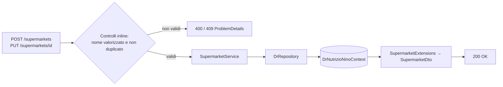
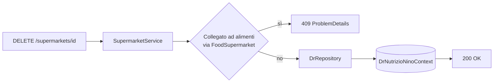

# Endpoint group: Supermarkets

## 1. Introduzione

Il gruppo `Supermarkets` gestisce l'anagrafica delle catene di supermercati, collegate agli alimenti da una relazione molti-a-molti. Serve a sapere dove è reperibile un determinato prodotto.

- **Route base:** `api/v1/supermarkets`
- **Tag Scalar:** `Supermarkets`
- **File di mapping:** `Endpoints/SupermarketsEndpoints.cs`
- **Versione API:** v1

## 2. Architettura

| Componente | Responsabilità |
|------------|----------------|
| `SupermarketsEndpoints` | Mapping e risposte `ProblemDetails` |
| `SupermarketService` | Logica applicativa CRUD e verifica utilizzo |
| `DrRepository` (`DrRepository.Supermarkets.cs`) | Accesso dati EF Core |
| `Supermarket`, `FoodSupermarket` | Entità EF Core, la seconda è la tabella di associazione con `Food` |
| `SupermarketExtensions` | Proiezione entità → DTO |
| `SupermarketDto`, `CreateSupermarketDto` | DTO di richiesta e risposta |

## 3. Descrizione endpoint

| Metodo | URL | Descrizione | Parametri | Risposta |
|--------|-----|-------------|-----------|----------|
| GET | `/api/v1/supermarkets` | Elenco di tutti i supermercati | — | `200` `IList<SupermarketDto>` · `404` |
| GET | `/api/v1/supermarkets/{id}` | Dettaglio supermercato | `id` (route, Guid) | `200` `SupermarketDto` · `404` |
| POST | `/api/v1/supermarkets` | Crea un supermercato | body `CreateSupermarketDto` | `200` `SupermarketDto` · `400` · `409` nome duplicato |
| PUT | `/api/v1/supermarkets/{id}` | Aggiorna un supermercato | `id` (route, Guid), body `Supermarket` | `200` · `400` · `404` · `409` |
| GET | `/api/v1/supermarkets/{id}/is-in-use` | Indica se il supermercato è collegato ad almeno un alimento | `id` (route, Guid) | `200` `bool` |
| DELETE | `/api/v1/supermarkets/{id}` | Elimina un supermercato | `id` (route, Guid) | `200` · `404` · `409` supermercato in uso |

**Autenticazione:** nessun endpoint del gruppo richiede autenticazione.

## 4. Flusso endpoint

> Il progetto non usa `IValidator<T>`: i controlli sull'input sono inline nell'handler.

## 5. Esempi

Nessun file `.http` dedicato a questo gruppo.

---
*Revisione v1.0 — 2026-07-29 22:24 — claude-opus-5*
