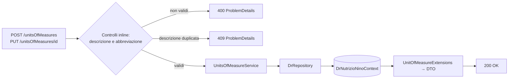
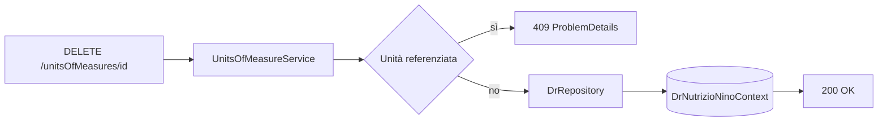

# Endpoint group: Units Of Measures

## 1. Introduzione

Il gruppo `Units Of Measures` gestisce l'anagrafica delle unità di misura usate da alimenti, nutrienti e piatti (grammi, millilitri, porzioni e simili). Espone il CRUD completo.

- **Route base:** `api/v1/unitsOfMeasures`
- **Tag Scalar:** `Units Of Measures`
- **File di mapping:** `Endpoints/UnitsOfMeasureEndpoints.cs`
- **Versione API:** v1

## 2. Architettura

| Componente | Responsabilità |
|------------|----------------|
| `UnitsOfMeasureEndpoints` | Mapping e risposte `ProblemDetails` |
| `UnitsOfMeasureService` | Logica applicativa CRUD |
| `UnitConversionService` | Conversioni tra unità, usata dal calcolo nutrizionale dei piatti |
| `DrRepository` (`DrRepository.UnitsOfMeasures.cs`) | Accesso dati EF Core |
| `UnitOfMeasure`, `UnitConversion` | Entità EF Core |
| `UnitOfMeasureExtensions` | Proiezione entità → DTO |
| `UnitOfMeasureDto`, `CreateUnitOfMeasureDto` | DTO di richiesta e risposta |

## 3. Descrizione endpoint

| Metodo | URL | Descrizione | Parametri | Risposta |
|--------|-----|-------------|-----------|----------|
| GET | `/api/v1/unitsOfMeasures` | Elenco di tutte le unità di misura | — | `200` `IList<UnitOfMeasureDto>` · `404` |
| GET | `/api/v1/unitsOfMeasures/{id}` | Dettaglio unità di misura | `id` (route, Guid) | `200` `UnitOfMeasureDto` · `404` |
| POST | `/api/v1/unitsOfMeasures` | Crea un'unità di misura | body `CreateUnitOfMeasureDto` | `200` `UnitOfMeasureDto` · `400` · `409` |
| PUT | `/api/v1/unitsOfMeasures/{id}` | Aggiorna un'unità di misura | `id` (route, Guid), body `UnitOfMeasure` | `200` · `400` · `404` · `409` |
| DELETE | `/api/v1/unitsOfMeasures/{id}` | Elimina un'unità di misura | `id` (route, Guid) | `200` · `404` · `409` unità in uso |

**Autenticazione:** nessun endpoint del gruppo richiede autenticazione.

## 4. Flusso endpoint

> Il progetto non usa `IValidator<T>`: i controlli sull'input sono inline nell'handler.

## 5. Esempi

Per i casi d'uso fare riferimento a `src/Dr.NutrizioNino.Api/Dr.NutrizioNino.Api.http`.

---
*Revisione v1.0 — 2026-07-29 22:24 — claude-opus-5*
