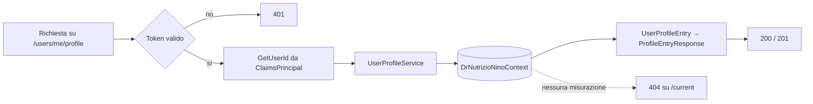

# Endpoint group: UserProfile

## 1. Introduzione

Il gruppo `UserProfile` registra e restituisce le misurazioni antropometriche dell'utente: peso, altezza, sesso e livello di attività. Ogni misurazione è una riga storica: l'ultima registrata rappresenta il profilo corrente ed è la base per il calcolo del fabbisogno nutrizionale.

- **Route base:** `api/v1/users/me/profile`
- **Tag Scalar:** `UserProfile`
- **File di mapping:** `Endpoints/UserProfileEndpoints.cs`
- **Versione API:** v1

## 2. Architettura

| Componente | Responsabilità |
|------------|----------------|
| `UserProfileEndpoints` | Mapping e risposte |
| `UserProfileService` | Lettura storico, lettura misurazione corrente, inserimento nuova misurazione |
| `UserProfileEntry` | Entità EF Core |
| `AddProfileEntryRequest`, `ProfileEntryResponse` | DTO di richiesta e risposta |
| `ClaimsPrincipalExtensions.GetUserId()` | Estrae l'id utente dal token |

Le misurazioni non si aggiornano: ogni variazione produce una nuova riga, così lo storico resta consultabile.

## 3. Descrizione endpoint

| Metodo | URL | Descrizione | Parametri | Risposta |
|--------|-----|-------------|-----------|----------|
| GET | `/api/v1/users/me/profile` | Storico completo delle misurazioni dell'utente | — | `200` `IList<ProfileEntryResponse>` |
| GET | `/api/v1/users/me/profile/current` | Ultima misurazione registrata | — | `200` `ProfileEntryResponse` · `404` |
| POST | `/api/v1/users/me/profile` | Aggiunge una misurazione (peso, altezza, sesso, attività) | body `AddProfileEntryRequest` | `201` `ProfileEntryResponse` |

**Autenticazione:** richiesta su tutto il gruppo (`RequireAuthorization()` sul `MapGroup`). Ogni operazione agisce solo sui dati dell'utente ricavato dal token.

## 4. Flusso endpoint

> Il progetto non usa `IValidator<T>`: i controlli sull'input sono inline nell'handler.

## 5. Esempi

Nessun file `.http` dedicato a questo gruppo.

---
*Revisione v1.0 — 2026-07-29 22:24 — claude-opus-5*
