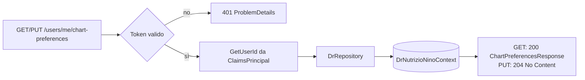

# Endpoint group: Users

## 1. Introduzione

Il gruppo `Users` conserva le preferenze di visualizzazione dell'utente autenticato. Attualmente espone la scelta dei nutrienti da mostrare nei grafici.

- **Route base:** `api/v1/users/me`
- **Tag Scalar:** `Users`
- **File di mapping:** `Endpoints/UserPreferencesMapping.cs`
- **Versione API:** v1

> Altri gruppi montano route più specifiche sotto lo stesso prefisso: `UserProfile` su `api/v1/users/me/profile` e `NutritionalTarget` su `api/v1/users/me/nutritional-target`.

## 2. Architettura

| Componente | Responsabilità |
|------------|----------------|
| `UserPreferencesMapping` | Mapping degli endpoint di preferenza |
| `DrRepository` | Lettura e scrittura delle preferenze |
| `ChartPreferencesResponse` | DTO di risposta |
| `ClaimsPrincipalExtensions.GetUserId()` | Estrae l'id utente dal token |

## 3. Descrizione endpoint

| Metodo | URL | Descrizione | Parametri | Risposta |
|--------|-----|-------------|-----------|----------|
| GET | `/api/v1/users/me/chart-preferences` | Nutrienti selezionati dall'utente per i grafici | — | `200` `ChartPreferencesResponse` · `401` |
| PUT | `/api/v1/users/me/chart-preferences` | Salva la selezione dei nutrienti per i grafici | body con l'elenco dei nutrienti scelti | `204` · `401` |

**Autenticazione:** richiesta su tutto il gruppo (`RequireAuthorization()` sul `MapGroup`).

## 4. Flusso endpoint

> Il progetto non usa `IValidator<T>`: i controlli sull'input sono inline nell'handler.

## 5. Esempi

Per i casi d'uso fare riferimento a `src/Dr.NutrizioNino.Api/UserPreferences.http`.

---
*Revisione v1.0 — 2026-07-29 22:24 — claude-opus-5*
