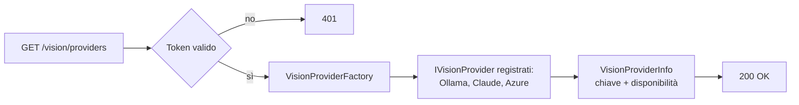

# Endpoint group: Vision

## 1. Introduzione

Il gruppo `Vision` espone l'elenco dei provider LLM disponibili per l'estrazione dei nutrienti da foto di etichette. Il frontend lo interroga per popolare la scelta del provider prima di chiamare `POST /api/v1/foods/extract-nutrients` (gruppo `Foods`).

- **Route base:** `api/v1/vision`
- **Tag Scalar:** `Vision`
- **File di mapping:** `Endpoints/VisionProvidersMapping.cs`
- **Versione API:** v1

## 2. Architettura

| Componente | Responsabilità |
|------------|----------------|
| `VisionProvidersMapping` | Mapping dell'endpoint di elenco |
| `VisionProviderFactory` | Conosce le implementazioni registrate e ne espone i metadati |
| `IVisionProvider` | Contratto dei provider |
| `OllamaVisionProvider` | Modello locale servito da Ollama |
| `ClaudeVisionProvider` | API Anthropic Claude |
| `AzureVisionProvider` | Azure OpenAI |
| `VisionProviderInfo` | DTO di risposta con chiave e disponibilità del provider |

I provider sono registrati come singleton in `Program.cs`: `OllamaVisionProvider` usa un `SemaphoreSlim` per serializzare le richieste al modello locale. La disponibilità di ciascun provider dipende dalla configurazione presente nella sezione `Vision` (endpoint, API key, deployment).

## 3. Descrizione endpoint

| Metodo | URL | Descrizione | Parametri | Risposta |
|--------|-----|-------------|-----------|----------|
| GET | `/api/v1/vision/providers` | Elenco dei provider LLM disponibili | — | `200` `IReadOnlyList<VisionProviderInfo>` |

**Autenticazione:** richiesta su tutto il gruppo (`RequireAuthorization()` sul `MapGroup`).

## 4. Flusso endpoint

L'endpoint non accede al database: legge solo la configurazione e i provider registrati nel container di dipendenze.

## 5. Esempi

Per i casi d'uso dell'estrazione vera e propria fare riferimento a `src/Dr.NutrizioNino.Api/FoodVision.http`.

---
*Revisione v1.0 — 2026-07-29 22:24 — claude-opus-5*
